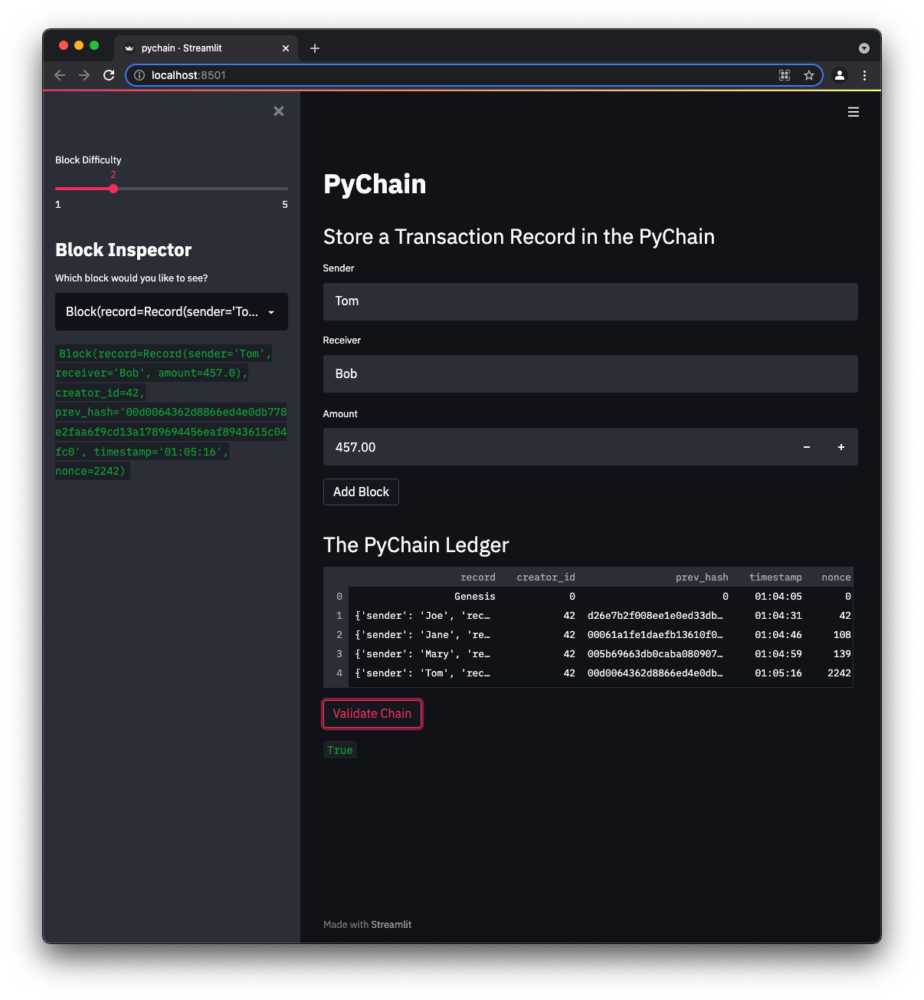

# PyChain Blockchain

This repo contains an implementation of a blockchain-based ledger system called PyChain, as well as web interface that can:
* add transaction blocks to the blockchain
* validate the entire blockchain
* modify the proof-of-work difficulty on a scale of 1 to 5
* inspect individual blocks in detail.

---

## Technologies

* Streamlit
* Python Dataclasses
* Python Typing
* Datetime
* Pandas
* Python Hashlib

---

## Installation Guide

This application is meant to run in Python 3.7.  The easiest way to install most of the dependencies is by installing the Anaconda distribution for Python 3.7.  Then just install Streamlit to your dev environment with `pip install streamlit`.

To start the PyChain web application, run `streamlit run pychain.py` at a terminal.

---

## Example

This example screenshot shows a blockchain with multiple blocks stored in it, as well as the results of validating the blockchain (see the `True` result under the `Validate Chain` button).

---

## Contributors

Michael Danenberg

---

## License

MIT